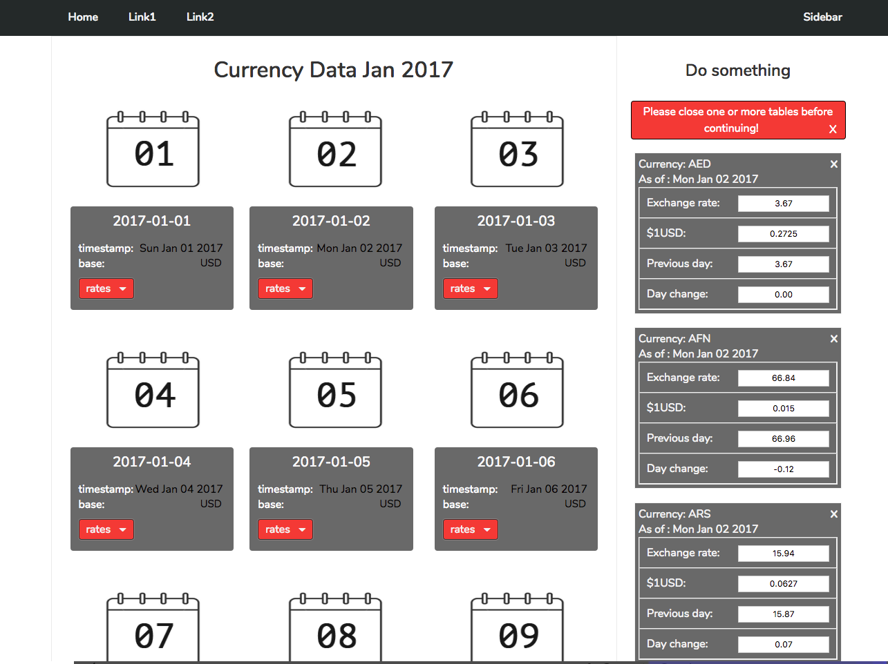
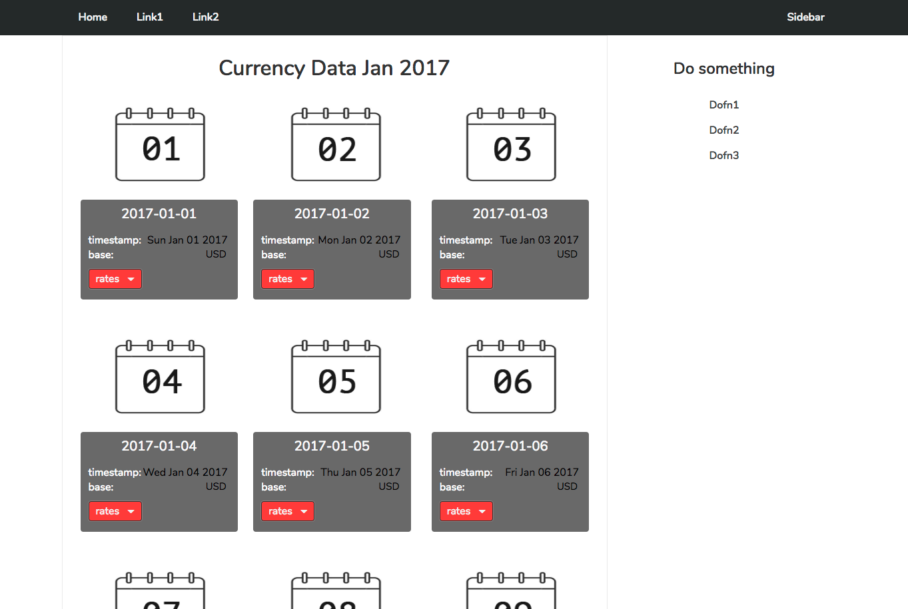
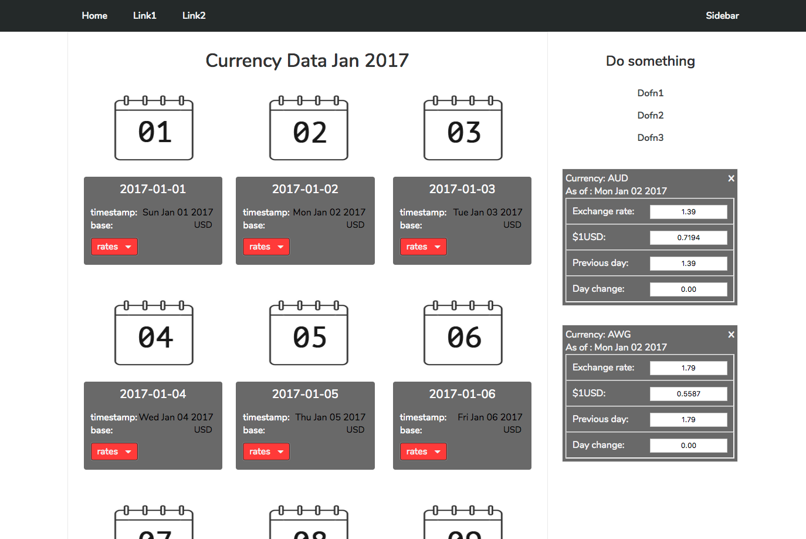
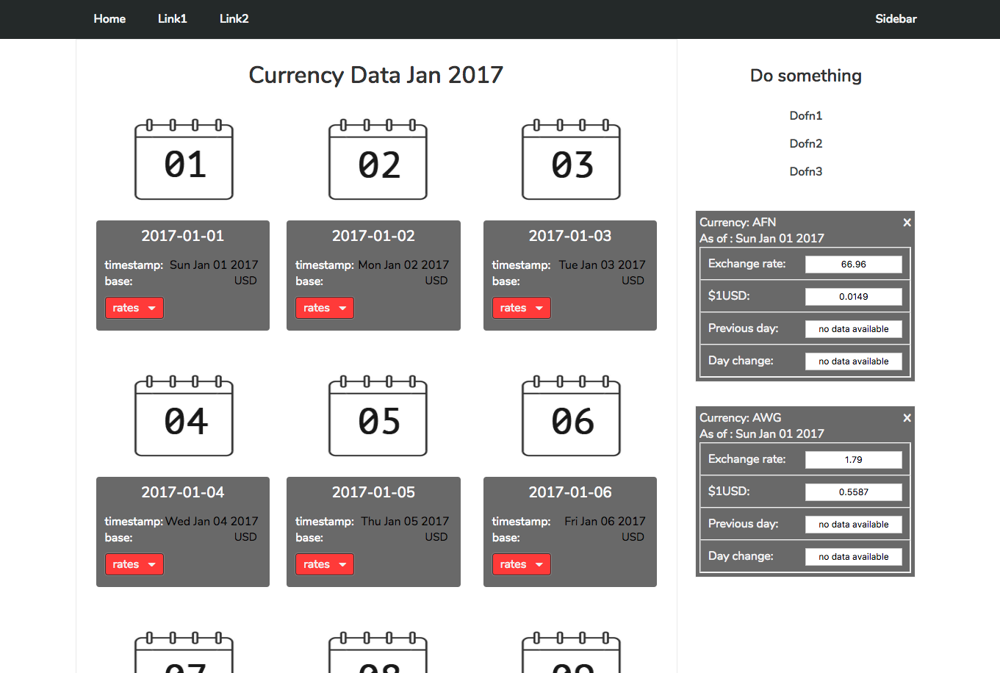
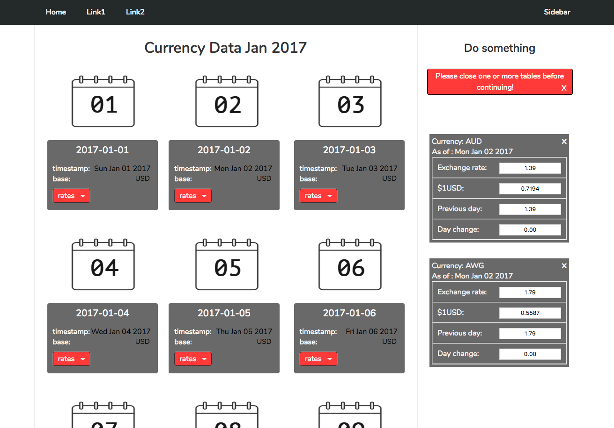
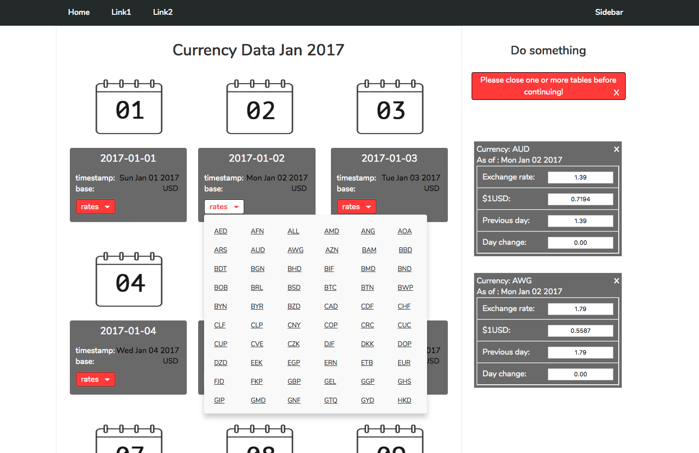

SPA-exercise  &nbsp; :rocket:
--------

- desktop only 1800px
- each h3,timestamp and base values collected on the fly from a json file.
- hover over rates to display dropdown list
- click on any one currency to show a table on sidebar that displays:
  +  currency
  +  date
  +  exchange rate
  +  dollar base
  +  previous day exchange (no data available if day is sunday jan 01)
  +  day change

- once you've clicked any 6 currencies, message appears asking you to close them
  before continuing  (..and removes sidebar menu in the process) (updated)
- or remove tables one by one (keeps track of how many tables are on display)  (updated) 
- closing message, removes both opened tables and restores sidebar navigation.

> local-server /http-server plugin

<kbd>six :ticket:</kbd>

 

<kbd>one :ticket:</kbd>

 

<kbd>two :ticket:</kbd>

 

<kbd>three :ticket:</kbd>

 

<kbd>four :ticket:</kbd>

 

<kbd>five :ticket:</kbd>

 

