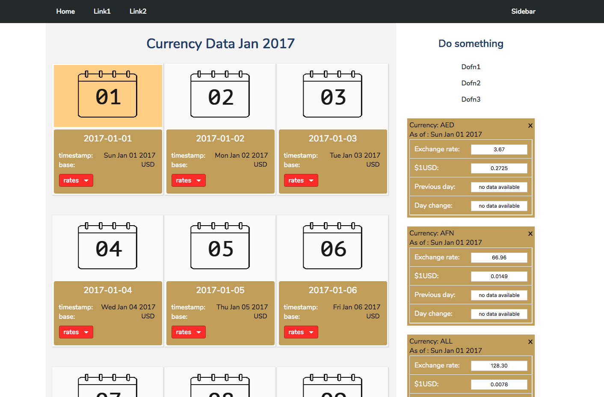
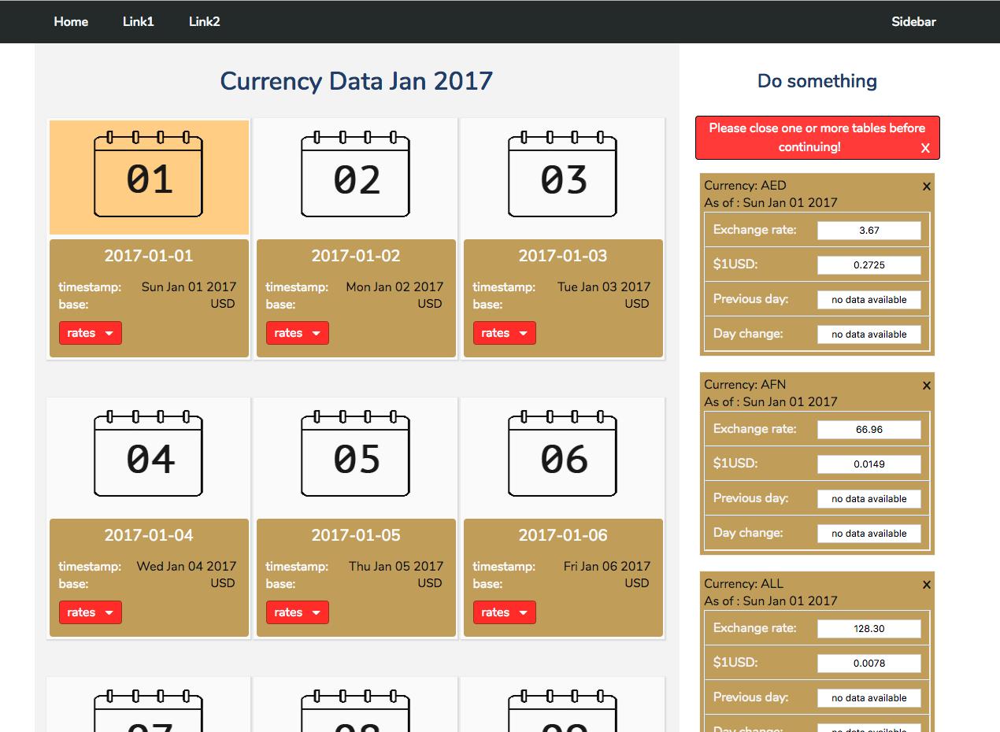
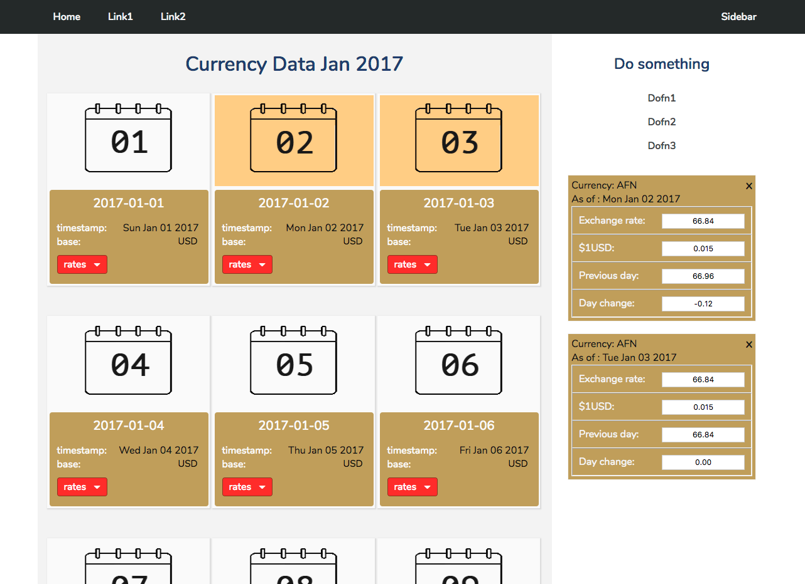
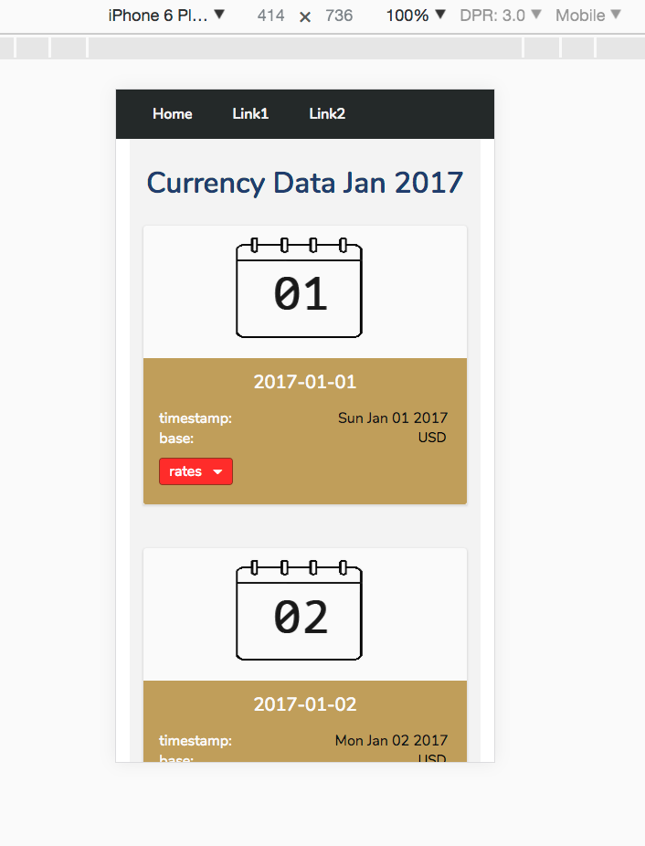
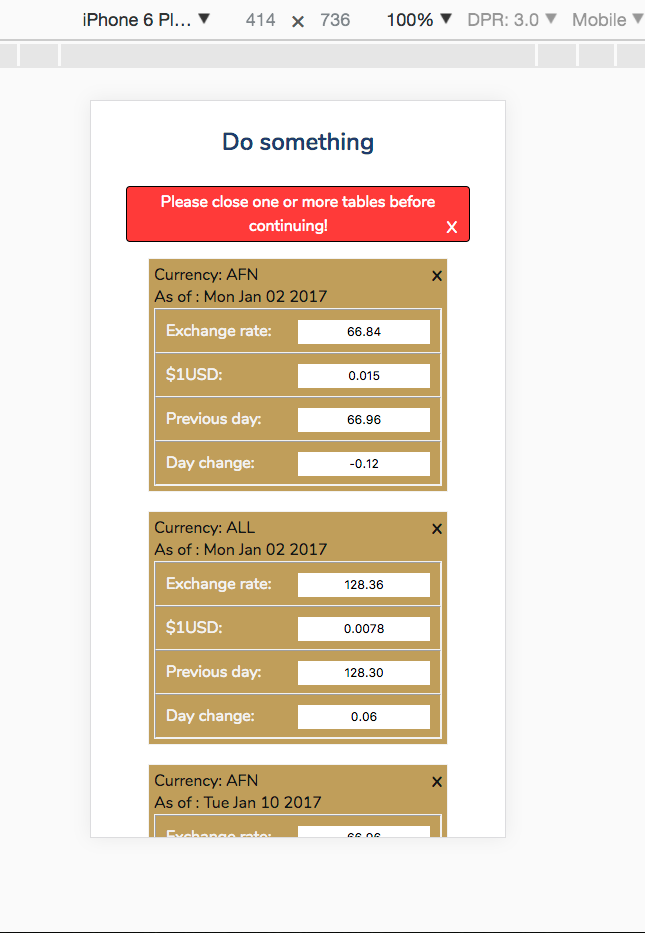

SPA-exercise  &nbsp; :rocket:
--------

- desktop and mobile -no tablet
- each h3,timestamp and base values collected dynamically.
- hover over rates to display dropdown list
- click on a currency to show a table on sidebar that displays:
  +  currency
  +  date
  +  exchange rate
  +  dollar base
  +  previous day exchange (no data available if day is sunday jan 01)
  +  day change

- once you've clicked any 7 currencies, message appears asking you to close them
  before continuing  (..and removes sidebar menu in the process) (updated) :hammer:    
- closing message, removes both opened tables and restores sidebar navigation.
- or close tables one by one - keeps tracks of tables and displays message on 8.  (updated) :hammer:

> you need to setup a local-server environment /http-server node-plugin

<kbd>one :ticket:</kbd>

 

<kbd>two :ticket:</kbd>

 

<kbd>three :ticket:</kbd>

 

<kbd>four :ticket:</kbd>

 

<kbd>five :ticket:</kbd>

 

 
:100:
